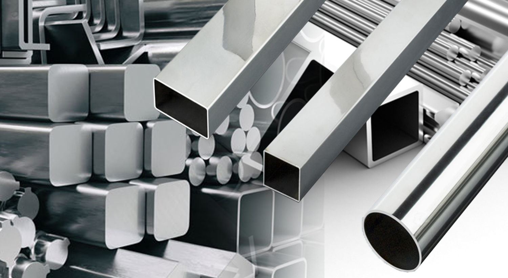

<h1 align="center"> 

🧾Cadastro de materia-prima
  
</h1> 

## 💡Solução  
Imagine que você tem uma ciderurgica(aquelas empresas que manuseiam metais) e você recebe um pedido de uma barra circular com raio de x, comprimento de x metros. Sabendo que o seu custo é calculado pelo peso da barra, após essa barra ser feita seria necessário uma balança com o comprimento de no minimo 6 metros também, para saber o peso e assim o custo.

Mas com esse programa em JAVA, é possivel descobrir o peso e o preço dessa barra circular antes mesmo de fabricada. Basta informar no caso do circulo o raio, comprimento e o <a href="http://rio.rj.gov.br/dlstatic/10112/7604908/4207844/TABELASOFGV02.pdf">Kg/m3</a>(referenta ao metal escolhido, encontrado na letra "e") e quando pesquisado, o sistema-lhe informará o peso e o custo da materia-prima usada, no desenvolvimeto da barra circular.

## Sobre🧑‍🏫

Este programa cadastra as seguntes formas:

 
- Circular

  
- Retangulo

   
- Quadrado

 

O programa realiza as 4 operações basicas de uma aplicação:

 
- Cria (Incluir Produto)

  
- Lê (Pesquisar Produto)

   
- Atualizar (Alterar Produto)

    
- Deletar (Excluir produto)

    
## Ferramentas🛠️

Linguagem de programação JAVA, JDK17,
Paradigma de desenvolvimento: Orientado a objetos(Herança, Poliformismo, Encapsulamento e Abstração),
IDE intellij.

